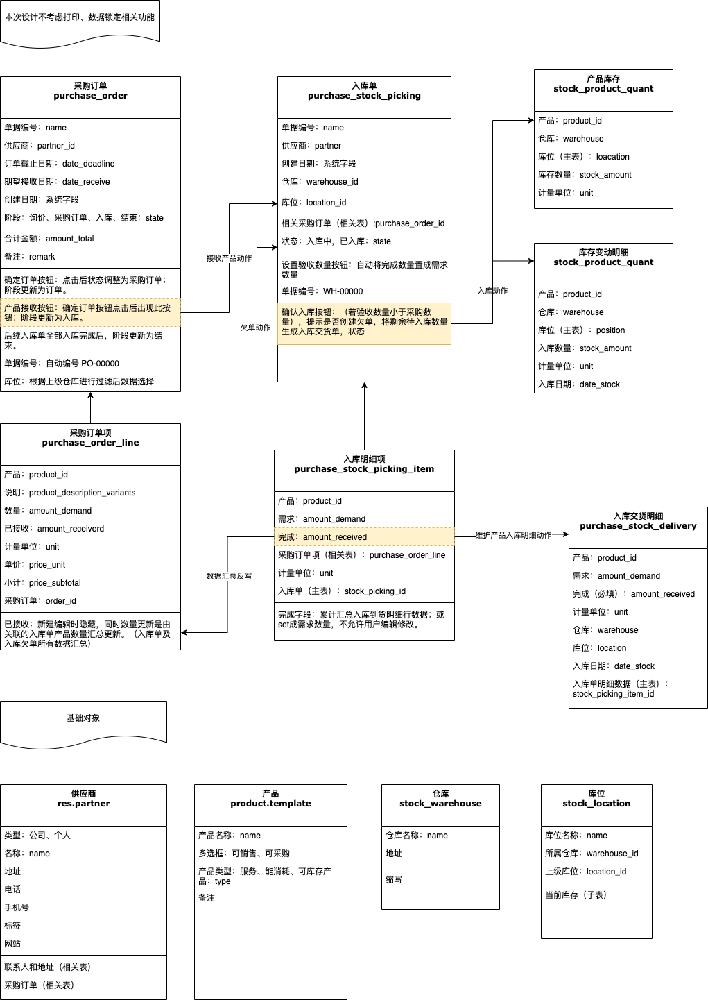

- 采购订单业务
    - 采购订单字段逻辑：
        - [ ]  采购订单项所有物料全部接收完成，“阶段”字段值更新为“结束”；
        - [ ]  库位字段根据上级仓库进行过滤后数据选择；
    - 采购订单项字段逻辑：
        - [ ]  “计量单位”字段根据选择的物料自动带出相应计量单位；
        - [ ]  “已接收数量”字段根据入库单及明细确认入库数量累计汇总计算；
    - 采购订单记录详情页按钮逻辑：
        - [ ]  “确定订单”按钮：点击确认后“阶段”字段值更新为“采购订单”；
        - [ ]  “物料接收”按钮：“采购订单”状态的记录才会显示此按钮，点击后，状态变更为“入库”，同时复制采购订单生成关联的入库单、入库明细项对象数据记录；
- 入库业务
    - 入库单详情页-”设置验收数量“按钮逻辑：
        - [ ]  一键将明细数据中的完成数量更新为需求数量；
        - [ ]  隐藏业务：相应的“入库交货明细表”中也要新增对应的明细记录（此处为自动新增记录）
    - 入库单详情页-”确认入库“按钮逻辑：
        - [ ]  （1-1）判断入库明细项中需求数量和完成数量字段是否相等，若相等，“状态”字段更新为“已入库”；
        - [ ]  （1-2）若不相等，提示用户“是否创建后续相应入库单？”，若否，将明细表记录中需求数量更新为完成数量后，主表“状态”字段更新为“已入库”
        - [ ]  （1-3）若创建，则在否的基础上（不创建后续入库单），生成新的入库单及入库明细单，同时明细数据中，需求数量为本次入库完成后剩余数量；
        - [ ]  （2）确认入库按钮后续业务逻辑：若物料为固定资产，则在资产卡片表中插入相应记录：非独立核算直接生成对应数量的一条记录；若独立核算则直接生成数量的条数记录；若非固定资产则无需单独考虑；
        - [ ]  入库明细项详细页面详细页面也可新建交货明细数据时，自动带出除完成数量外的其他字段信息，同时数量字段汇总到入库明细项完成数量字段。
- 业务流程图

    
